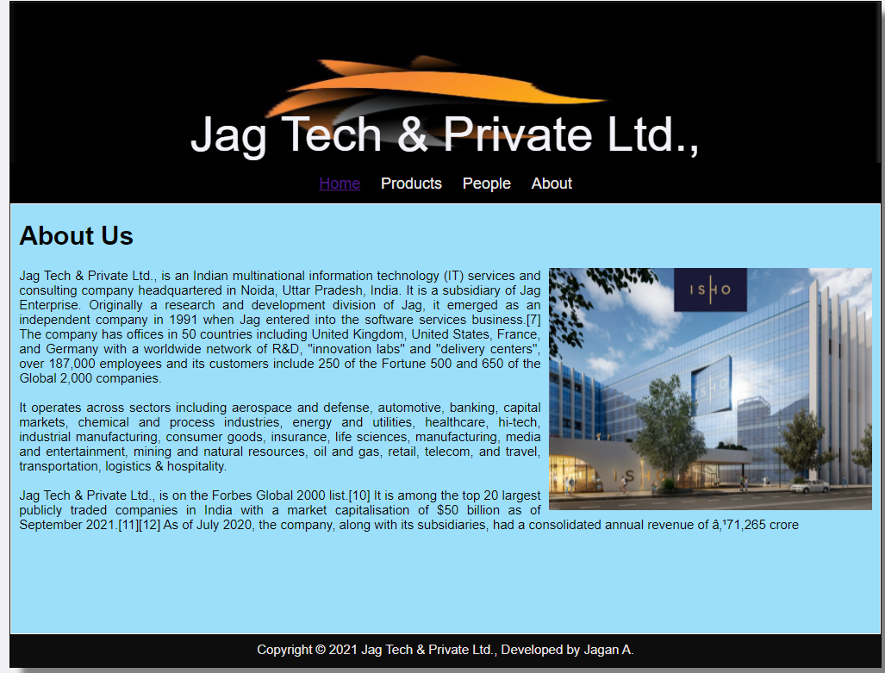
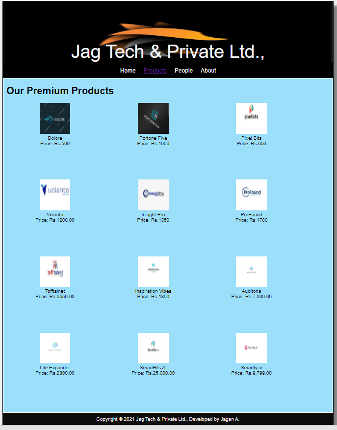
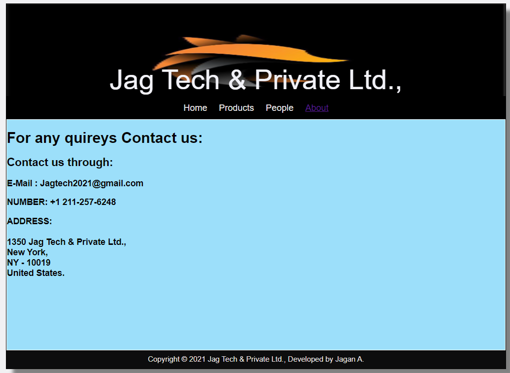

# Web Design for a Software Product Company

## AIM:

To design a static website for a software product company company.

## DESIGN STEPS:

### Step 1:

Requirement collection.

### Step 2:

Creating the layout using HTML and CSS.

### Step 3:

Updating the sample content.

### Step 4:

Choose the appropriate style and color scheme.

### Step 5:

Validate the layout in various browsers.

### Step 6:

Validate the HTML code.

### Step 6:

Publish the website in the given URL.

## PROGRAM :

### Layout.css:
~~~
* {
  box-sizing: border-box;
  font-family: Arial, Helvetica, sans-serif;
}
body {
  background-color: #f1f1f3;
  color: #050505;
}
.container {
  width: 1080px;
  margin-left: auto;
  margin-right: auto;
  border-width: 1px 1px 1px 1px;
  border-style: solid;
  box-shadow: 15px 15px 8px gray;
}

.banner {
  display: block;
  width: 100%;
  height: 200px;
  text-align: center;
  font-size: 60px;
  background-image: url("/static/img/logo.jpeg");
  background-size: 100% 100%;
  margin: 0px 0px 0px 0px;
  padding-top: 130px;
  color: #f2f2f8;
}

.menu {
  display: block;
  width: 100%;
  height: 50px;
  font-size: larger;
  background-color: black;
  text-align: center;
  padding-top: 15px;
  margin: 0px 0px 0px 0px;
  border-width: 1px;
}

.menuitem {
  display: inline-block;
  margin-left: 10px;
  margin-right: 10px;
}
.menuitemselected {
  display: inline-block;
  margin-left: 10px;
  margin-right: 10px;
  color: #fff9f9;
}

.menuitem a {
  text-decoration: none;
  color: #e9e7e7;
}

.content {
  display: block;
  width: 100%;
  background-color: #9cdffa;
  min-height: 500px;
  margin: 0px 0px 0px 0px;
  border-width: 1px;
  border-color: white;
  border-style: solid;
}
.homecontent {
  min-height: 500px;
  margin: 10px 10px 10px 10px;
}
.homecontent h1 {
  text-align: left;
}
.homecontent img {
  float: right;
  width: 400px;
  height: 300px;
  margin-left: 10px;
}

.contenttext {
  text-align: justify;
}

.productcontent {
  min-height: 500px;
  margin: 10px 10px 10px 10px;
}

.productcontent h1 {
  text-align: left;
}

.productitems {
  display: block;
}

.productitem {
  display: inline-block;
  width: 30%;
  height: 250px;
  text-align: center;
}

.productitem img {
  width: 100px;
  height: 100px;
  display: block;
}
.productitem .itemimage {
  display: block;
  margin-left: auto;
  margin-right: auto;
  width: 100px;
  margin-bottom: 5px;
}

.productitem .itemname {
  display: block;
}
.productitem .itemprice {
  display: block;
}

.footer {
  display: block;
  width: 100%;
  height: 40px;
  background-color: #0d0d0e;
  text-align: center;
  padding-top: 10px;
  margin: 0px 0px 0px 0px;
  color: #ece5e5;
}
~~~
### Home Page:
~~~
<!DOCTYPE html>
<html lang="en">
  <head>
    <title>Jag Tech & Private Ltd.,</title>
    <link rel="stylesheet" href="./css/layout.css" />
    <link rel="icon" href="./img/icon.png" type="image/x-icon" />
  </head>

  <body>
    

      
Jag Tech & Private Ltd.,

      

        
<a href="/static/home.html">Home</a>

        
<a href="/static/products.html">Products</a>

        
<a href="/static/people.html">People</a>

        
<a href="/static/About.html">About</a>

      

      

        

          <h1>About Us</h1>
          
          

            Jag Tech & Private Ltd., is an Indian multinational information technology (IT) services and consulting company headquartered in Noida, Uttar Pradesh, India. It is a subsidiary of Jag Enterprise. Originally a research and development division of Jag, it emerged as an independent company in 1991 when Jag entered into the software services business.[7] The company has offices in 50 countries including United Kingdom, United States, France, and Germany with a worldwide network of R&D, "innovation labs" and "delivery centers", over 187,000 employees and its customers include 250 of the Fortune 500 and 650 of the Global 2,000 companies.
              
            It operates across sectors including aerospace and defense, automotive, banking, capital markets, chemical and process industries, energy and utilities, healthcare, hi-tech, industrial manufacturing, consumer goods, insurance, life sciences, manufacturing, media and entertainment, mining and natural resources, oil and gas, retail, telecom, and travel, transportation, logistics & hospitality.
              
            Jag Tech & Private Ltd., is on the Forbes Global 2000 list.[10] It is among the top 20 largest publicly traded companies in India with a market capitalisation of $50 billion as of September 2021.[11][12] As of July 2020, the company, along with its subsidiaries, had a consolidated annual revenue of ₹71,265 crore 
              
            

        

      

      

        Copyright &#169; 2021 Jag Tech & Private Ltd., Developed by Jagan A.
      

    

  </body>
</html>
~~~
### Products:
~~~
<!DOCTYPE html>
<html lang="en">
  <head>
    <title>Jag Tech & Private Ltd.,</title>
    <link rel="stylesheet" href="./css/layout.css" />
    <link rel="icon" href="./img/icon.png" type="image/x-icon" />
  </head>

  <body>
    

      
Jag Tech & Private Ltd.,

      

        
<a href="/static/home.html">Home</a>

        

          <a href="/static/products.html">Products</a>
        

        
<a href="/static/people.html">People</a>

        
<a href="/static/About.html">About</a>

      

      

        
    
          <h1>Our Premium Products</h1>
          

              
 
                  

                  
                  

                  
Dolore

                  
Price: Rs.500 

              

              
 
                  

                  
                  

                  
Portone Five

                  
Price: Rs.1000 

              

              
 
                

                
                

                
Pixel Bits

                
Price: Rs.650 

              

              
 
                

                
                

                
Volanto

                
Price: Rs.1200.00 

              

              
 
                

                
                

                
Insight Pro

                
Price: Rs.1350 

              

              

                

                
                

                
ProFound

                
Price: Rs.1780 

              

              
 
                

                
                

                
Tofftalnet

                
Price: Rs.5550.00 

              

              
 
                

                
                

                
Inspiration Vibes

                
Price: Rs.1800

              

              
 
                

                
                

                
Auditoria

                
Price: Rs.7,000.00 

              

              
 
                

                
                

                
Life Expander

                
Price: Rs.2800.00 

              

              
 
                

                
                

                
SmartBits AI

                
Price: Rs.25,000.00 

              

              
 
                

                
                

                
Smartly.ai

                
Price: Rs.9,799.00 

              

          

          
        
      

      

        Copyright &#169; 2021 Jag Tech & Private Ltd., Developed by Jagan A.
      

    

  </body>
</html>
~~~
### People:
~~~
<!DOCTYPE html>
<html lang="en">
    <head>
        <title>Jag Tech & Private Ltd.,</title>
        <link rel="stylesheet" href="./css/layout.css" />
        <link rel="icon" href="./img/icon.png" type="image/x-icon" />
    </head>
    <body>
        

            
Jag Tech & Private Ltd.,

            

                
<a href="/static/home.html">Home</a>

                
<a href="/static/products.html">Products</a>

                
<a href='/static/people.html'>People</a>

                
<a href='/static/About.html'>About</a>

            

            

                

                    <h1>Our Crew Welcomes You All</h1>
                    

                        

                            

                                
                            

                            
Shantanu Narayanan

                            
CEO

                        

                        

                            

                                
                            

                            
Tim Cook

                            
Manager

                        

                        

                            

                                
                            

                            
Bob Chepak

                            
Asst. Manager

                        

                        

                            

                                
                            

                            
Kevin fiege

                            
Sales Executive

                        

                        

                            

                                
                            

                            
Robert Pattinson

                            
Managing Director

                        

                        

                            

                                
                            

                            
Robert Abbas

                            
Office Executive

                        

                    

                

            

            

                Copyright &#169; 2021 Jag Tech & Private Ltd., Developed by Jagan A.
            

        

    </body>
</html>
~~~
### Contact Us:
~~~
<!DOCTYPE html>
<html lang="en">
    <head>
        <title>Jag Tech & Private Ltd.,</title>
        <link rel="stylesheet" href="./css/layout.css" />
        <link rel="icon" href="./img/icon.png" type="image/x-icon" />
    </head>

    <body>
        

            
Jag Tech & Private Ltd.,

            

                
<a href="/static/home.html">Home</a>

                
<a href="/static/products.html">Products</a>

                
<a href='/static/people.html'>People</a>

                
<a href='/static/About.html'>About</a>

            

            

                

                    <h1>For any quireys Contact us:</h1> 
                    

                        <h2>Contact us through:</h2>
                        <h3>E-Mail : Jagtech2021@gmail.com</h3>
                        <h3>NUMBER: +1 211-257-6248</h3>
                        <h3>ADDRESS:   1350 Jag Tech & Private Ltd., New York, NY - 10019   United States.</h3>
                    

                

            

            

            Copyright &#169; 2021 Jag Tech & Private Ltd., Developed by Jagan A.
            

        

    </body>
</html>
~~~
## OUTPUT:

### Home Page:

### Products:

### People:

### Contact Us:

## Result:

Thus a website is designed for the software product company and the HTML,CSS code are validated.
